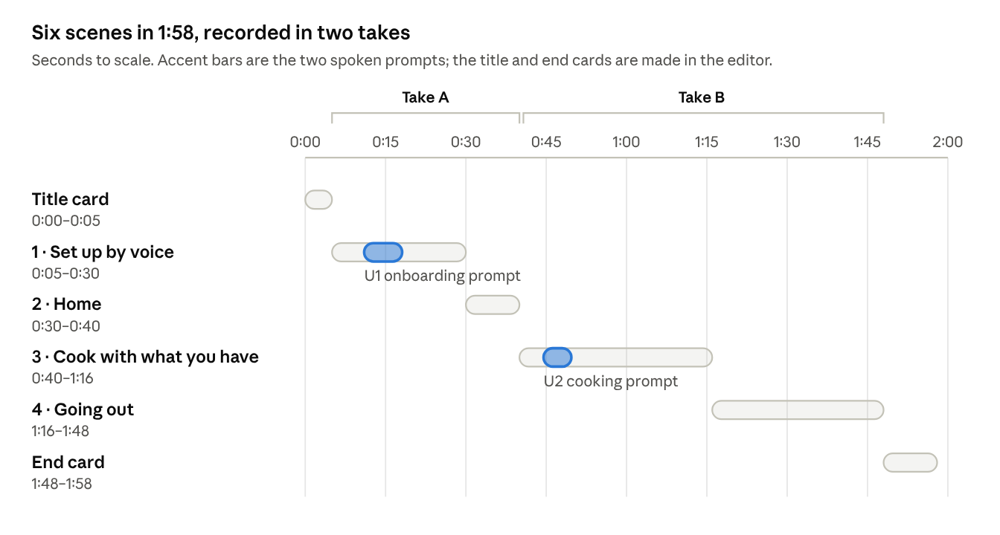
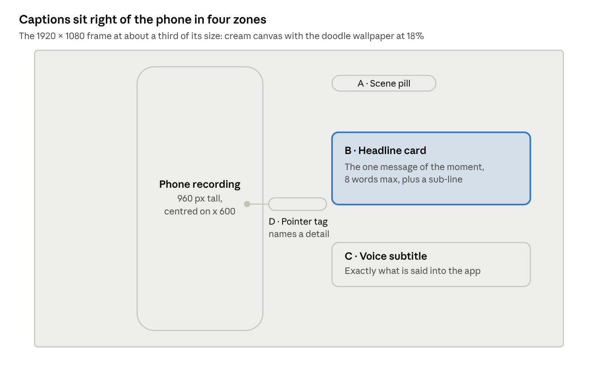

# WhatToEat — 2-minute demo video script

Oct 3, 2026 · nivedita

## Overview

The finished video runs 1:58 in six scenes: a title card, voice onboarding, the home page, cooking from what you have (by voice), planning a dinner out (by typing), and an end card.



Take A covers scenes 1 and 2, take B scenes 3 and 4, and the cut between them hides under a doodle wipe at 0:40. The two spoken prompts land at 0:11 and 0:44.

- **Format:** 1920 × 1080, 30 fps. The app is recorded in Chrome, then placed on a cream canvas with the app's doodle wallpaper; all captions sit to the right of the phone.
- **Raw vs. final length:** the raw recording runs about 3 minutes, because AI answers take 5–15 seconds. Every wait is trimmed to 2–3 seconds in the edit (see Editing notes).
- **Voiceover throughout:** a narrator voice explains each step, and a second voice speaks the two prompts the app hears. All audio is pre-generated (see Voiceover and audio); nobody speaks during recording.

## Before you record

Record in two takes, with Chrome playing the generated prompt as its microphone, so the app hears exactly what viewers hear. Chrome's stand-in microphone plays one file per launch, so the onboarding prompt (take A) and the cooking prompt (take B) need separate launches.

- [ ] Use Google Chrome on a Mac. The demo runs in its own Chrome window with a separate profile, so your normal Chrome can stay open.
- [ ] **Take A** (scenes 1–2): run the take A command below in Terminal. It opens the app with the onboarding prompt as the microphone and mic permission already granted.
- [ ] **Take B** (scenes 3–4): close the take A window, run the take B command, then do onboarding off camera by typing: tap **Get started**, the keyboard icon (top right), type the onboarding sentence from Voiceover and audio, tap **Continue**, then **Start eating**. Start recording on the home page.
- [ ] Record between 5 pm and 4 am local time, so the home header reads “What are we eating tonight?” (4–11 am it says “this morning”, 11 am–5 pm “today”).
- [ ] Leave 3 minutes between takes. The AI service throttles bursts of requests, and back-to-back takes get slow.
- [ ] After tapping a mic, wait: the prompt starts 4 seconds in and runs 5–7 seconds. Tap stop within 6 seconds of it ending, before the file loops.
- [ ] Screen recorder: Cmd + Shift + 5 → **Record Selected Portion**, drawn tightly around the phone frame. Under **Options**, set **Microphone** to **None**; all sound comes from the generated audio track.
- [ ] Notifications off (macOS Focus), and click highlighting on if your recorder has it (otherwise add click rings in the edit).

Take A command:

```bash
open -na "Google Chrome" --args --user-data-dir=/tmp/w2e-take-a --window-size=1280,1000 --use-fake-ui-for-media-stream --use-fake-device-for-media-stream --use-file-for-fake-audio-capture=$HOME/Downloads/WhatToEat-demo/voice-input/U1-onboarding-mic.wav https://mosaic-seven-henna.vercel.app
```

Take B command:

```bash
open -na "Google Chrome" --args --user-data-dir=/tmp/w2e-take-b --window-size=1280,1000 --use-fake-ui-for-media-stream --use-fake-device-for-media-stream --use-file-for-fake-audio-capture=$HOME/Downloads/WhatToEat-demo/voice-input/U2-cook-mic.wav https://mosaic-seven-henna.vercel.app
```

## Look of the video

Everything around the phone reuses the app's own design: a cream canvas, forest-ink outlines, bold tight type and the food doodles. The captions then read as part of the product.

**Canvas.** Cream `#FBF4E6` fills the 1920 × 1080 frame. The app's doodle wallpaper (the 36 doodles in `assets/doodles/`) is scattered over it at 18% opacity, fainter than in the app so captions stay readable.

**Phone.** The recorded phone frame is scaled to 960 px tall (about 457 px wide), centred at x = 600 px, with 60 px above and below. Nothing covers the phone screen except click rings and zoom-ins.

**Text zones** (frame coordinates in px, 0,0 = top-left):

| Zone | Position | Used for |
| --- | --- | --- |
| A · Scene pill | Caption area top: left edge x 1080, centre y 120 | Scene number and name, e.g. “1 · Set up by voice” |
| B · Headline card | Caption area middle: x 1080–1800, centred on y 430 | The one message of the moment, 8 words max, plus an optional sub-line |
| C · Voice subtitle | Caption area lower: x 1080–1800, y 700–860 | Exactly what you say into the app |
| D · Pointer tag | Gap between phone and captions: x 850–1060, at the height of the UI detail | Names a detail on screen, with a line to it |
| Full frame | Whole frame | Title card and end card only |



The scene pill (A) stays up for a whole scene, headline cards (B) change with the narration, and the subtitle (C) and pointer tags (D) appear only for their moment.

**Text styles:**

| Style | Shape | Type (Inter Tight, free on Google Fonts) | Colours |
| --- | --- | --- | --- |
| Scene pill | Fully rounded pill, 3 px ink outline, padding 12 × 24 px | ExtraBold 800, 26 px, letter-spacing −0.5 px | Turmeric `#F5B50F` fill, ink `#10372B` text, like the app's “Decide in 60 seconds” pill |
| Headline card | The app's offset card: white card, 4 px ink outline, 28 px corners, padding 28 × 36 px, on a lime block of the same size offset 14 px right and down (also ink-outlined) | Headline Black 900, 52 px, letter-spacing −1.5 px, line height 1.05; sub-line SemiBold 600, 28 px | Ink headline; sub-line `#5B6E66`; at most one key word in chilli `#E8412C` |
| Voice subtitle | Speech bubble: cobalt `#2D4BFF` fill, 4 px ink outline, 28 px corners, small tail pointing left at the phone, white mic icon at the start | Bold 700, 32 px, in quotes | White text |
| Pointer tag | The app's outline pill: white fill, 3 px ink outline; a 2 px ink line from the tag ends in a 12 px lime dot (ink outline) on the UI detail | Bold 700, 22 px | Ink text |
| Title and end card | Centred stack: W2E badge 360 px (`web/icons/Icon-512.png`), wordmark, turmeric pill | Wordmark Black 900, 120 px, letter-spacing −4 px | Ink on the cream doodle canvas |

**How text appears.** Motion copies the app's feel: quick and springy, nothing slower than 0.3 s.

- **Headline card in:** scales 92% → 100% and rises 24 px in 0.25 s (ease-out, slight overshoot). Its lime block slides out from behind to the 14 px offset 0.1 s later. **Out:** drops 16 px and fades in 0.2 s.
- **Scene pill:** slides in from 60 px right of its spot in 0.25 s at each scene start; between scenes, only its words cross-fade (0.15 s).
- **Voice subtitle:** the bubble pops in as you start speaking, and words appear one by one in step with your voice. It leaves 0.5 s after you tap stop.
- **Pointer tag:** the line draws from the tag to the detail in 0.2 s, then the tag pops in.
- **Sparkles:** on the three big moments (H2, H6, H10) two or three of the app's four-point sparkles (lime, blush, turmeric, 24–32 px, ink outline) pop at the headline card's corners once, for 0.4 s.
- **Scene change:** a doodle parade wipe. Six to eight doodles stream left to right across the frame along a wave in 0.7 s, the same motion as the in-app loader, hiding the cut.
- **Clicks:** a 48 px lime ring with a 3 px ink outline expands and fades at the click point (0.3 s).
- **Zoom-ins:** a 1.25× push onto the part of the phone a caption talks about: 0.4 s in, hold, 0.4 s out.

## Scene-by-scene script

Times are final-video times. While recording, just follow the order and wait for each screen; the edit trims the waits. Text IDs (S, H, V, D) are spelled out in On-screen text.

### Scene 0 · Title card · 0:00–0:05 (made in the editor)

| Time | On screen | Do this | Audio | Text on screen |
| --- | --- | --- | --- | --- |
| 0:00.0 | Title card: cream canvas, faint doodle wallpaper | — | VO01 at 0:00.3 | TITLE card builds in, full frame |
| 0:04.3 | Doodle parade wipe into the phone | — | — | — |

### Scene 1 · Set up by voice · 0:05–0:30 (take A)

Pages: Welcome → About you → You're all set!

| Time | On screen | Do this | Audio | Text on screen |
| --- | --- | --- | --- | --- |
| 0:05.0 | Welcome: W2E badge, “WhatToEat”, “Decide in 60 seconds”, **Get started** | Start recording take A on this page | — | S1 slides in (zone A) |
| 0:06.5 | Same | Click **Get started** (dark pill, bottom of the phone) | VO02 | H1 pops in (zone B) |
| 0:07.0 | About you: “Tell me about your everyday food preferences”, example pills, cobalt mic | — | — | — |
| 0:08.5 | Label under the mic: “Getting ready… hold on a sec” | Click the cobalt **mic** (bottom centre) | — | Click ring |
| 0:10.5 | Label turns “Speak now — tap to finish”, rings pulse | Hands off; the prompt plays by itself | — | — |
| 0:11.0 | Transcript box fills word by word above the mic; answer chips appear under it | Wait | U1 plays (7.1 s) | V1 in (zone C), word by word; D1 at 0:15 points at the chips |
| 0:19.0 | Mic area: small doodle parade, “Understanding what you said…”, then “Saving your taste profile…” (trim to 1.5 s) | Click the **stop** button (same spot) | VO03 | V1, D1 and H1 out |
| 0:21.0 | You're all set! Summary: “Vegetarian · Loves South Indian & Street Food · Usually spicy · Healthy options first” | Wait about 7 s | VO03 continues | H2 pops with sparkles; 1.25× zoom on the summary card, 0:21.5–0:26 |
| 0:28.5 | Same | Click **Start eating** (dark pill, bottom) | — | H2 out |

### Scene 2 · Home · 0:30–0:40 (take A)

Page: Home.

| Time | On screen | Do this | Audio | Text on screen |
| --- | --- | --- | --- | --- |
| 0:30.0 | Home: date and time, “What are we eating tonight?”, W2E badge, doodle wallpaper, “Tell me what you're craving” card, doodle categories | Wait 2 s | VO04 at 0:30.5 | S2 replaces S1; H3 pops in |
| 0:32.0 | Page moves through Trending Now, Celebrity Chef Recipes, Star Recipes, Popular Restaurants | **Scroll down** slowly with the trackpad, about 4 s | — | — |
| 0:36.5 | Back at the header | **Scroll up** to the top, about 1.5 s | — | — |
| 0:38.5 | Home, still | Stop recording take A after 2 s | — | H3 out at 0:39.5 |

### Scene 3 · Cook with what you have · 0:40–1:16 (take B)

Pages: Home → What do you want? → Your picks → Recipe → Home. Before recording take B, do onboarding by typing (see Before you record).

| Time | On screen | Do this | Audio | Text on screen |
| --- | --- | --- | --- | --- |
| 0:40.0 | Home (take B) | Start recording take B; click the **Tell me what you're craving** card | VO05 at 0:40.5 | Doodle parade wipe over the cut; S3 replaces S2; H4 pops in |
| 0:41.0 | What do you want?: “What are you in the mood for?”, cobalt mic | — | — | — |
| 0:42.5 | “Getting ready… hold on a sec” | Click the **mic** | — | Click ring |
| 0:44.5 | “Speak now”; the transcript fills word by word, and answer chips appear under it as they're understood (With: Paneer, Capsicum, Onions) | Wait | U2 plays (5.2 s) | V2 in (zone C), word by word |
| 0:50.5 | “Understanding what you said…”, then the full doodle loader “Finding your picks…” with five answer chips under it: Meal: dinner · How: cook · Flavour: Spicy · With: Paneer, Capsicum, Onions · Time: 15 minutes (trim the loader to 3 s) | Click **stop** | VO06 | V2 out at 0:51; H5 replaces H4; D2 points at the answer chips, 0:51.5–0:55 |
| 0:55.0 | Your picks: “Here are 3 great options for you”; the first card shows **Healthy** already selected in lime | Wait 2 s | — | H5 out at 0:56 |
| 0:57.0 | Calorie pill goes up | Click **Regular** on the first card's toggle | VO07 | D3 points at the toggle |
| 0:59.5 | Calorie pill comes back down | Click **Healthy** | — | — |
| 1:01.5 | — | Click **View recipe** (dark pill, first card) | — | D3 out |
| 1:02.5 | Recipe: photo, title, time · kcal · cuisine chips, Regular/Healthy toggle, nutrition, Ingredients, Method; **I'm having this** floats at the bottom. If “Writing your recipe…” shows first, trim it to 1 s | Wait 1 s | VO08 | H6 pops with sparkles |
| 1:03.5 | Ingredients, then Method | **Scroll down** slowly, about 6 s | — | 1.25× zoom on Ingredients, 1:04–1:07 |
| 1:10.0 | — | Click **I'm having this** | — | H6 out |
| 1:11.0 | Home: “Meal logged!” bar at the bottom; lime “… kcal today · 1 meal logged” card under the categories | Wait 4 s | VO09 | H7 pops in; D4 points at the lime card |

### Scene 4 · Going out · 1:16–1:48 (take B)

Pages: Home → What do you want? → What flavours → What's the vibe? → Your picks → Menu → Home.

| Time | On screen | Do this | Audio | Text on screen |
| --- | --- | --- | --- | --- |
| 1:16.0 | Home | Click the **Tell me what you're craving** card | VO10 at 1:16.5 | S4 replaces S3; H7, D4 out; H8 pops in |
| 1:17.0 | What do you want? | Click **Type instead** (keyboard icon under the mic) | — | — |
| 1:18.0 | Text box and **Continue** | Click the text box and type **I am going out for dinner** at a natural pace (about 2.5 s) | — | Zoom 1.25× on the text box, 1:18–1:23 |
| 1:21.5 | Chips “Meal: dinner · How: dine” under the box | Wait 1 s | — | D5 points at the chips |
| 1:22.5 | — | Click **Continue** | — | H8, D5 out |
| 1:23.5 | “Understanding…” (1 s), then “What flavours are you feeling?” Spicy / Light / Comforting / Sweet | — | VO11 | H9 pops in |
| 1:25.0 | Spicy turns lime | Click **Spicy**, then **Next** | — | — |
| 1:27.0 | “What's the vibe?” Casual / Quick bite / Something special / Surprise me | Click **Casual** | — | — |
| 1:28.0 | Doodle loader “Finding your picks…” with chips Meal: dinner · How: dine · Flavour: Spicy · Vibe: casual (trim to 2 s) | Wait | — | H9 out |
| 1:30.5 | Your picks: “Here are 3 places worth heading out to”; restaurant cards with a dish photo, cuisine · vibe · ₹₹, highlight pills, **View menu**; no calories | Wait about 6 s | VO12 at 1:31 | H10 pops with sparkles |
| 1:37.5 | — | Click **View menu** on the first card | — | H10 out |
| 1:38.5 | Menu: photo, name, **Find on Google Maps**, “What to order” sections with green veg marks and ₹ prices; **Let's go here** floats at the bottom. If “Pulling up the menu…” shows, trim it to 1 s | Wait 1 s | VO13 at 1:39 | H11 pops in; D6 points at the first green veg mark |
| 1:40.0 | Starters into Mains | **Scroll down** slowly, about 5 s | — | D6 out at 1:41 |
| 1:45.5 | — | Click **Let's go here** | — | H11 out |
| 1:46.5 | Home with “Enjoy your meal at …!” | Stop recording take B at 1:48 | — | — |

### Scene 5 · End card · 1:48–1:58 (made in the editor)

| Time | On screen | Do this | Audio | Text on screen |
| --- | --- | --- | --- | --- |
| 1:48.0 | Doodle parade wipe out of the phone | — | — | S4 out |
| 1:48.7 | End card: cream canvas, faint doodle wallpaper | — | VO14 at 1:50 | END card builds in, full frame |
| 1:57.0 | Fade to cream | — | — | — |

## Voiceover and audio

All sound is generated in advance, so nobody speaks during recording. A narrator reads 14 short lines, and a second voice speaks the user's two prompts. One file, `demo-audio-track.wav`, already holds every clip at its time: put it on the timeline at 0:00 and fit the picture to it.

### Voices

- **Narrator: Sarvam Bulbul v3, speaker Aditya** (male, Indian English). Calm at 2.6 words a second: the slowest of the voices that read the test line without a single error, which suits explaining.
- **User: Gnani Timbre v2.5, voice Kaveri** (female, Indian English). Sounds like someone talking to an app, the app's own speech-to-text heard her word for word, and she is easy to tell apart from the narrator.

**How they were picked.** Two Apple voices, six Sarvam voices and six Gnani voices each read one narration line (VO03) and one user prompt (U2). Every recording was transcribed back by both Gnani's and Sarvam's speech-to-text, and each word that came back wrong counted against the voice.

| Voice | Narration line: words wrong (Gnani / Sarvam check) | User prompt: words wrong | Pace (words/s) | Result |
| --- | --- | --- | --- | --- |
| Sarvam Aditya | 0% / 0% | 11%\* | 2.6 | **Narrator** |
| Sarvam Shubh | 0% / 0% | 11%\* | 3.5 | Clear, but brisker |
| Sarvam Priya, Kavya, Ritu, Rohan | 0–10% | 11%\* | 2.2–3.1 | A word or two misheard |
| Gnani Kaveri | 0% / 0% | 0% | 3.3 | **User voice** |
| Gnani Pranav | 0% / 0% | 0% | 3.1 | Best male alternative |
| Gnani Girish, Shlok, Devika, Trupti | 0–20% | 0% | 3.1–3.7 | A word or two misheard |
| Apple Aman, Tara (built into macOS) | 5–65% | 0% | — | Not allowed in a published video |

\*Every Sarvam voice says “I've” as “I have”. That's harmless in narration, but in a user prompt the subtitle would no longer match what viewers hear.

**Why not Apple's built-in voices.** The macOS licence allows its system voices only “for your personal, non-commercial use” and rules out “publishing or redistribution … in a profit, non-profit, public sharing or commercial context” ([macOS Tahoe 26 licence](https://www.apple.com/legal/sla/docs/macOSTahoe.pdf), section 2F). They also did worst on the test line: Aman cut it short, and Tara's was misheard in places.

### Narration

Files: `voiceover/VO01.wav` to `VO14.wav` (48 kHz, mono). Each clip ends before the next sound starts.

| ID | Starts | Runs | Line |
| --- | --- | --- | --- |
| VO01 | 0:00.3 | 5.1 s | What are we eating tonight? WhatToEat helps you decide in under a minute. |
| VO02 | 0:06.5 | 3.8 s | Setting up takes one sentence. Just say how you eat. |
| VO03 | 0:19.0 | 7.2 s | It transcribes as you speak, then works out what you meant: dosas and chaat become South Indian and street food. |
| VO04 | 0:30.5 | 8.3 s | Home changes with the time of day, with quick picks, trending dishes, chef recipes and popular restaurants. |
| VO05 | 0:40.5 | 2.6 s | Cooking tonight? Just say what's in the kitchen. |
| VO06 | 0:50.5 | 5.3 s | One sentence answered all five questions. Every pick is vegetarian, like the profile. |
| VO07 | 0:57.0 | 4.8 s | Healthy versions show first, as asked. Regular is one tap away. |
| VO08 | 1:02.5 | 7.3 s | The recipe is written on the spot, around the paneer, capsicum and onions you actually have. |
| VO09 | 1:11.0 | 3.3 s | One tap logs the meal, and today's total updates. |
| VO10 | 1:16.5 | 3.0 s | Eating out instead? Typing works just as well. |
| VO11 | 1:23.5 | 5.4 s | It asks only what it still needs: flavour, then the vibe. |
| VO12 | 1:31.0 | 7.3 s | For a night out, you get places to go, not calories to count, each with a suggested order. |
| VO13 | 1:39.0 | 6.5 s | The menu keeps to vegetarian dishes, with prices, and a link to find the place on Google Maps. |
| VO14 | 1:50.0 | 5.9 s | Cook, order in, or dine out. WhatToEat: decide what to eat in under a minute. |

### The user's prompts

| ID | Scene | Starts · runs | Words (the subtitle shows exactly these) | What the app picked up (live site, 3 Oct) |
| --- | --- | --- | --- | --- |
| U1 | 1 · Set up by voice | 0:11.0 · 7.1 s | I'm vegetarian. I'm a big fan of dosas and chaat, I love spicy food, I have no allergies, and I prefer healthy options. | Vegetarian · South Indian + Street Food · Spicy · No allergies · Healthy first |
| U2 | 3 · Cook with what you have | 0:44.5 · 5.2 s | I've got paneer, capsicum and onions at home. I want to cook something quick and spicy for dinner. | Dinner · Cook · Spicy · Paneer, Capsicum, Onions · 15 minutes |

Each prompt has two files in `voice-input/`: the clip itself (`U1-onboarding.wav`, `U2-cook.wav`) for the edit, and a `-mic` copy with 4 s of silence before and 8 s after, which Chrome plays as its microphone while you record.

### Typed text

- **Take B, off camera:** the onboarding answer, typed exactly as U1 reads: I'm vegetarian. I'm a big fan of dosas and chaat, I love spicy food, I have no allergies, and I prefer healthy options.
- **Scene 4, on camera:** I am going out for dinner

### Files

All in `~/Downloads/WhatToEat-demo/`:

| File | What it is |
| --- | --- |
| `demo-audio-track.wav` | The finished soundtrack without music: 1:58, every clip at its time, 48 kHz mono |
| `voiceover/VO01.wav` … `VO14.wav` | The narrator's lines |
| `voice-input/U1-onboarding.wav`, `U2-cook.wav` | The two prompts, for the edit |
| `voice-input/U1-onboarding-mic.wav`, `U2-cook-mic.wav` | Padded copies for Chrome's microphone |
| `voice-comparison/`, `voice-comparison-results.json` | Samples and scores from the voice test |
| `tools/make_audio.py` | Regenerates any of the above |

### Changing a line or a voice

`make_audio.py` holds every line, start time and voice. It reads the API keys from the project's `.env` and needs nothing installed.

1. In `tools/make_audio.py`, edit the line in `VO` or the words in `PROMPTS`, or change `NARRATOR` or `USER_VOICE`, for example `NARRATOR = ('sarvam', 'priya')` or `('gnani', 'Pranav')`.
2. Run, in Terminal:

```bash
cd ~/Downloads/WhatToEat-demo
python3 tools/make_audio.py voiceover VO05   # one clip; leave out the ID for all 14
python3 tools/make_audio.py prompts          # after changing a prompt or the user voice
python3 tools/make_audio.py track            # rebuild the full track
```

If a new line is too long for its slot, the script first speeds the voice up slightly, then says so if it still doesn't fit. Changing a prompt's words also means updating its subtitle (V1 or V2) and re-recording that take, because the app hears the new words.

## On-screen text

Every word that appears on screen, in order. Shapes, type and motion are set in Look of the video; zones A–D are the caption areas to the right of the phone. In a headline, the **bold** word is the one set in chilli red.

### Title and end cards (full frame)

| ID | In → out | Stack, top to bottom | How it appears |
| --- | --- | --- | --- |
| TITLE | 0:00.0 → 0:04.3 | W2E badge (360 px) · wordmark “WhatToEat” · turmeric pill “Decide what to eat in 60 seconds” | Badge pops in, scaling 80% → 100% while turning from −10° to 0° (0.35 s); wordmark rises 24 px into place at 0:00.4; pill slides in from the right at 0:00.8. Leaves with the doodle parade wipe at 0:04.3. |
| END | 1:48.7 → 1:58.0 | W2E badge · “WhatToEat” · turmeric pill “Cook · Order in · Dine out” · outline pill “mosaic-seven-henna.vercel.app” | Badge and wordmark build as on TITLE; the turmeric pill slides in at 1:50.0 with VO14; the URL pill pops in at 1:52.5, as VO14 says “WhatToEat”. Everything fades to cream from 1:57.0. |

### Scene pills (zone A)

| ID | Words | In → out |
| --- | --- | --- |
| S1 | 1 · Set up by voice | 0:05.0 → 0:30.0 |
| S2 | 2 · Your home screen | 0:30.0 → 0:40.0 |
| S3 | 3 · Cook with what you have | 0:40.0 → 1:16.0 |
| S4 | 4 · Going out tonight | 1:16.0 → 1:48.0 |

S1 slides in from the right; at each later change only the words cross-fade. S4 leaves with the closing doodle wipe.

### Headline cards (zone B)

| ID | Headline | Sub-line | In → out | Extra |
| --- | --- | --- | --- | --- |
| H1 | Just **say** how you eat | No forms. One sentence sets up your profile. | 0:06.5 → 0:19.0 |  |
| H2 | “Dosas and chaat” **→** South Indian + Street Food | It reads meaning, not keywords | 0:21.0 → 0:28.5 | Sparkles |
| H3 | **Every** meal starts here | Changes with the time of day | 0:30.0 → 0:39.5 |  |
| H4 | Say what's in your **kitchen** | — | 0:40.0 → 0:50.5 |  |
| H5 | Picks that fit your **diet** | All vegetarian, like your profile | 0:50.5 → 0:56.0 | Replaces H4 directly |
| H6 | A recipe written for your **fridge** | Built around paneer, capsicum and onions | 1:02.5 → 1:10.0 | Sparkles |
| H7 | Logged in one **tap** | — | 1:11.0 → 1:16.0 |  |
| H8 | Or just **type** it | — | 1:16.0 → 1:22.5 |  |
| H9 | Asks only what's **missing** | — | 1:23.5 → 1:28.0 |  |
| H10 | **Places** to go, not calories to count | Each with a suggested order | 1:30.5 → 1:37.5 | Sparkles |
| H11 | What to **order**, with prices | Plus a Google Maps link | 1:38.5 → 1:45.5 |  |

### Voice subtitles (zone C)

| ID | Words | In → out |
| --- | --- | --- |
| V1 | “I'm vegetarian. I'm a big fan of dosas and chaat, I love spicy food, I have no allergies, and I prefer healthy options.” | 0:11.0 → 0:19.5 |
| V2 | “I've got paneer, capsicum and onions at home. I want to cook something quick and spicy for dinner.” | 0:44.5 → 0:51.0 |

The bubble pops in with the first word; the words then appear one at a time in step with U1 or U2 (up to three lines), and the bubble leaves 0.5 s after the stop tap.

### Pointer tags (zone D)

| ID | Words | Points at | In → out |
| --- | --- | --- | --- |
| D1 | Picked up as you speak | The answer chips under the transcript box (About you) | 0:15.0 → 0:19.0 |
| D2 | 5 answers from 1 sentence | The five answer chips under “Finding your picks…” | 0:51.5 → 0:55.0 |
| D3 | Lighter version: fewer kcal | The Regular / Healthy toggle on the first card | 0:57.0 → 1:01.5 |
| D4 | Today's total | The lime “kcal today” card on Home | 1:11.0 → 1:16.0 |
| D5 | Dinner + dining out | The chips “Meal: dinner · How: dine” under the text box | 1:21.5 → 1:22.5 (hold 1 s longer; see Editing notes) |
| D6 | Veg only, as per your profile | The first green veg mark on the menu | 1:38.5 → 1:41.0 |

Each tag sits level with its detail: the line draws first (0.2 s), then the tag pops in.

### Also on screen (no words)

- Click rings at every tap (0.3 s, lime with an ink outline).
- Zoom-ins: the summary card 0:21.5–0:26, Ingredients 1:04–1:07, the text box 1:18–1:23.
- Doodle parade wipes: 0:04.3 (into the phone), 0:40.0 (hides the cut between takes), 1:48.0 (out to the end card).

## Editing notes

Any editor works (CapCut, iMovie, DaVinci Resolve, Premiere). Work in this order:

1. **Lay the audio first.** Put `demo-audio-track.wav` on the timeline at 0:00 and lock it. Every time in this script comes from it: cut the picture to fit the sound, never the other way round.
2. **Join the takes.** Take A fills 0:05–0:40 and take B 0:40–1:48. Make the cut at 0:40.0, under the doodle parade wipe.
3. **Line up each prompt.** The recordings are silent, and Chrome starts the prompt about 4 seconds after the mic tap. Shorten the “Speak now” wait so the tap lands where the scene table puts it (0:08.5 for U1, 0:42.5 for U2); the first words then appear on screen about a second after the voice starts.
4. **Trim the AI waits.** Keep 2–3 s of each “Finding your picks…” loader and about 1 s of “Understanding…”, “Writing your recipe…” and “Pulling up the menu…”, and cut the rest. The doodles never stop moving, so put a 4-frame cross-dissolve on every cut inside a loader.
5. **Give D5 a second more.** The dine chips are on screen for only 1 s before the Continue tap. Freeze that frame for one extra second and take the second back from the “Understanding…” wait after it.
6. **Voice subtitles.** Run your editor's auto-captions on `U1-onboarding.wav` and `U2-cook.wav` only, in a word-by-word style, then restyle them as the cobalt bubble. Check the words against V1 and V2: auto-captions often misspell “chaat” and “capsicum”.
7. **Captions for muted autoplay.** `demo-captions.srt` in the demo folder holds every spoken line with its time. Attach it as closed captions when uploading; don't burn it in, since the headline cards already fill the caption area.
8. **Music (optional).** Something light and bright, ducked about 20 dB under every voice clip, fading out from 1:56 under the end card.
9. **Export.** 1920 × 1080, 30 fps, H.264 at about 12 Mbps, AAC 48 kHz. The finished file runs 1:58.

## If something goes wrong

The AI answers differently on every run, so a take can come out slightly different from the script. Most of it is fixed in the edit; redo a take only where this table says so.

| What happens | What to do |
| --- | --- |
| A follow-up question appears after you speak (for example “What flavours are you feeling?”) | The app missed one answer. Tap the answer the prompt gave and carry on; cut the question out in the edit. |
| The first words are missing from the transcript | The connection opened slowly. Close the window, run the take's command again and redo the take. |
| The prompt starts playing a second time | Stop was tapped too late and the file looped. Redo the take, tapping stop within 6 seconds of the prompt ending. |
| The first card has no Regular / Healthy toggle, or shows the fork-and-knife placeholder instead of a photo | Tap **Surprise me** (top right) for a fresh set of three, and cut that out in the edit. Avoid **Not feeling it**: it swaps in a built-in example dish, not a new AI pick. A placeholder on the half-visible second card can stay. |
| The picks ignore paneer, capsicum and onions | The AI service was busy, so the app fell back to built-in examples. Wait 3 minutes, then redo the take. |
| An AI step takes more than 15 seconds | Keep recording; the wait is trimmed in the edit. |
| Home says “today” or “this morning” instead of “tonight” | The headline follows the clock: record between 5 pm and 4 am. |
| Chrome asks for microphone permission | The take command should grant it. If Chrome still asks, click Allow, close the window and run the command again. |
